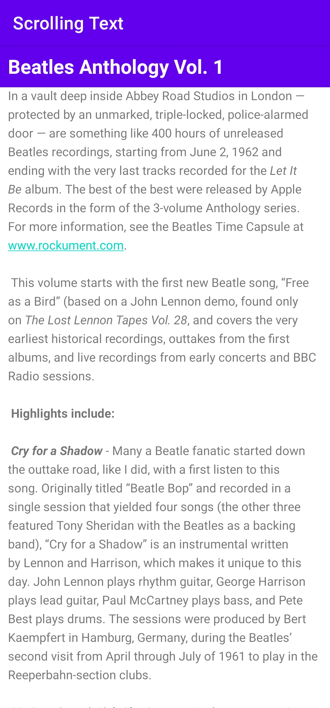
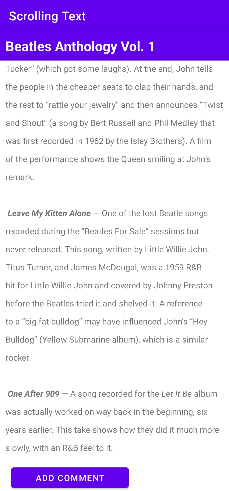
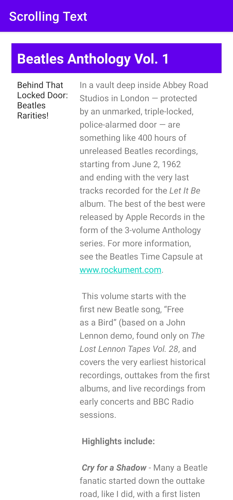

# ScrollText
I learnt about scrollview while creating scrolling text app.
It is basically like the article where it has title, subtitle and a description.
It has also tasks, coding challenge and homework.

First talks about tasks,
In task part it has three tasks add edittext, add scroll view with web link and at last add multiple element in the scroll view.
Scroll view support only one element so if we have to use multiple element then we have to use another layout like linear layout, relative layout, constraint layout etc.

The tasks performed is shown below:

{:height="50%" width="50%"}

{:height="50%" width="50%"}

Second one is Coding challenge,
In coding challenge,
I have to put a simple button in the bottom of the description named "Add a Comment".
Not required to perform any onClick action in this button.
the proof the required challenge shown below:

{:height="50%" width="50%"}

Third one is Homework
In Homework,
It is required to align horizontally to both subheading and description which are shown below:

{:height="50%" width="50%"}

{:height="50%" width="50%"}

So thats all for the scrolling text app.
